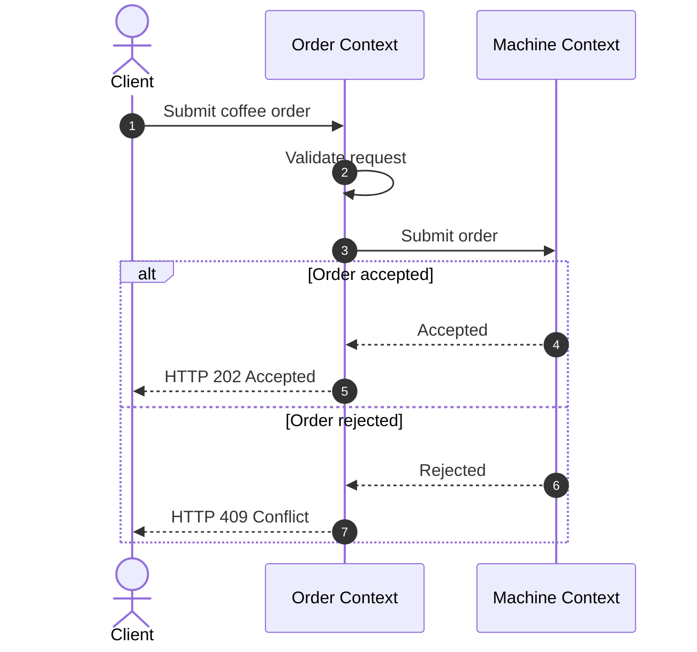
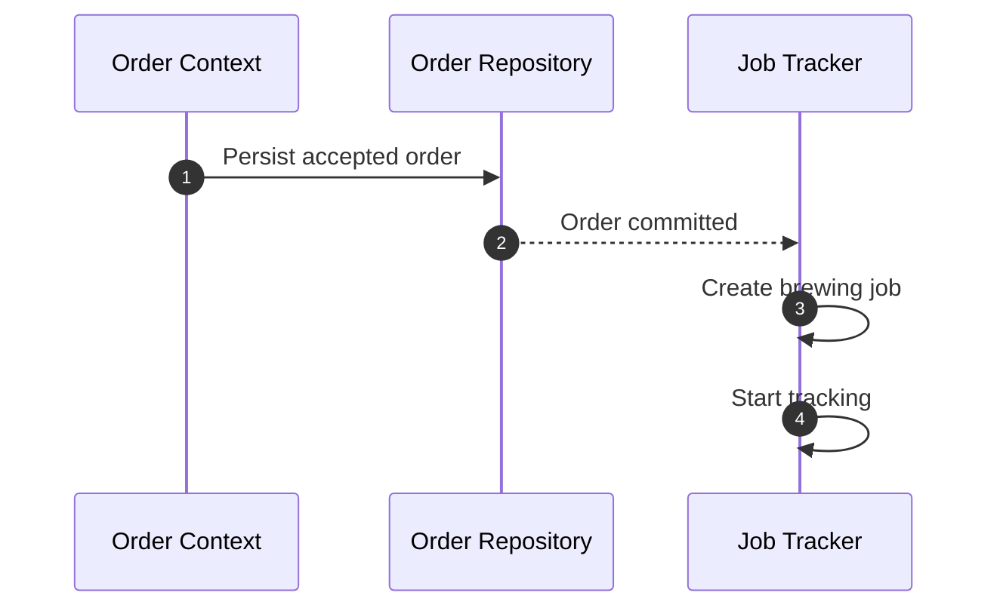
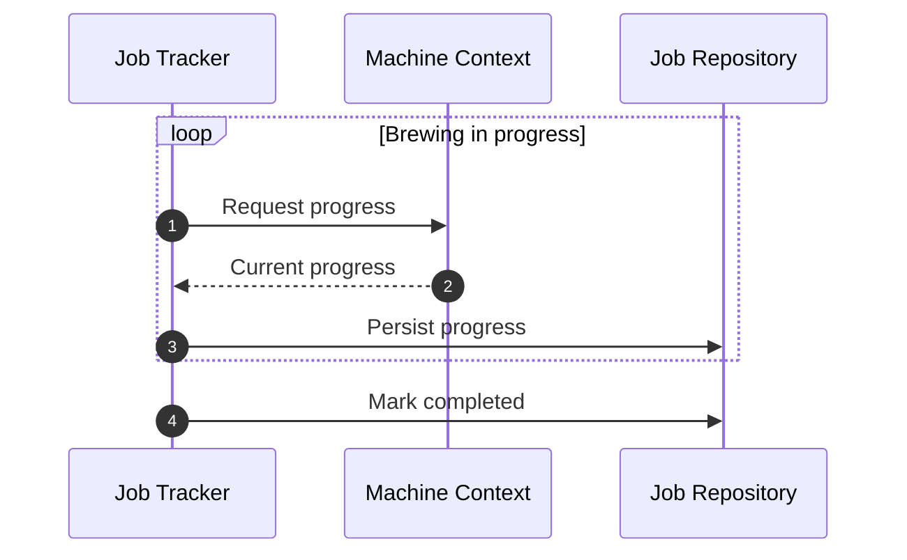
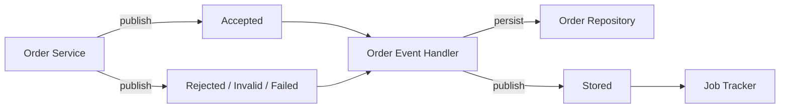
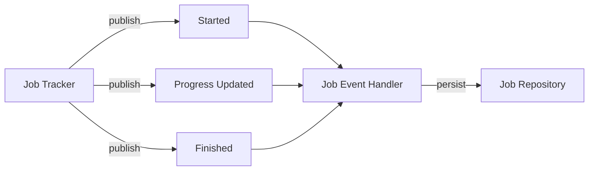
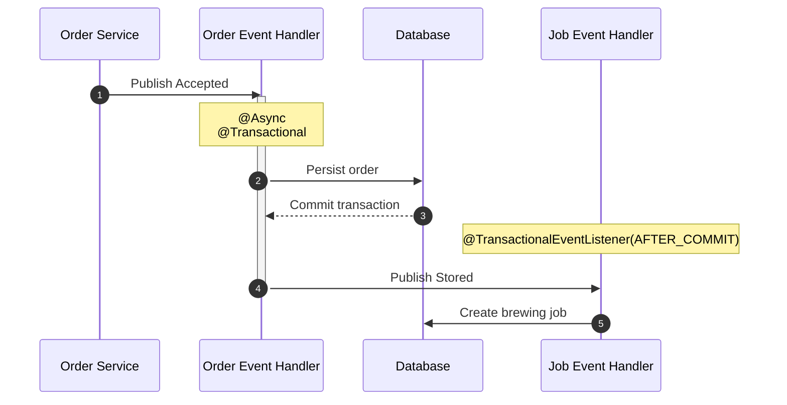

# Architecture

## Overview

The backend architecture follows a modular, domain-oriented architecture inspired by patterns commonly used in enterprise applications. Although the business domain is intentionally simple, the project emphasizes clear module boundaries, event-driven communication, and separation between business logic and infrastructure.

## Components

The backend is organized around a small number of components, each responsible for a distinct part of the coffee ordering workflow.

### Order

The order component serves as the primary entry point into the backend. It accepts client requests, validates them, communicates with the coffee machine, and manages the lifecycle of coffee orders from creation through their final outcome.

### Job

The job component is responsible for everything that happens after an order has been accepted. It tracks brewing progress in the background, records state changes for auditing, and monitors jobs until they complete or fail.

### Machine

The machine component encapsulates all communication with the external component representing the physical coffee machine. It provides a stable API for the rest of the application while isolating protocol-specific concerns such as HTTP communication, request mapping, and error handling behind a dedicated boundary.

## Structure

The backend is organized into loosely defined bounded contexts inspired by Domain-Driven Design. Rather than grouping code by technical layers, each context represents a business capability and exposes a small public surface while keeping its implementation details encapsulated.

Shared domain concepts are placed in `coffee.model`, which acts as a shared kernel. Cross-cutting abstractions live in `common`, while their implementations reside in `infra`, allowing business code to remain independent of the underlying framework.

For example, the `coffee.machine` bounded context is organized as follows:

```text
coffee.machine
├── api
│   ├── CoffeeMachineController
│   ├── CoffeeMachineClient
│   ├── CoffeeMachineStatus
│   └── exception
└── internal
    ├── HttpCoffeeMachineClient
    ├── MachineConfiguration
    └── MachineProperties
```

The `api` package defines everything intended to be used by other parts of the application or exposed externally, while the `internal` package contains implementation details that remain private to the bounded context.

## Request Lifecycle

The following diagrams illustrate the lifecycle of a successful coffee order, from the initial client request to asynchronous job tracking in the background.

Every coffee order begins with the following request flow:

1. Client submits a coffee order
2. The order context validates the request and forwards it to the coffee machine
3. The machine accepts or rejects the order
4. The client receives the result



Once an order has been accepted, processing continues asynchronously in the background:

1. The accepted order is persisted
2. Once the order has been committed, a brewing job is created
3. The job tracker periodically queries the machine for progress
4. Progress updates and the final outcome are persisted





## Communication

### Model

The backend combines synchronous API calls with asynchronous domain events.

Synchronous communication is used whenever a component requires an immediate response, such as submitting an order to the coffee machine or querying its current brewing progress. Once a business outcome has been determined, responsibility is handed to the next stage of the workflow through domain events. Many of these tasks continue asynchronously because they no longer affect the immediate client response.

The diagram below shows how an order moves once its outcome is known:



The same approach is used while tracking the brewing process:



### Domain Events

When implementing the order workflow, one design question kept coming up: _what actually belongs in the order service?_ Submitting an order to the coffee machine clearly does, but persisting orders for auditing or starting a background job felt like separate responsibilities.

Rather than allowing the service to gradually accumulate more responsibilities, it simply publishes the outcome of the operation and lets the next stage of the workflow take over.

This naturally led to an event-driven communication model. Once a business event has occurred, such as an order being accepted or a brewing job reporting progress, the component responsible for that stage publishes an event and its work is complete. Other components can react to the event without the publisher needing to know who they are or what they do.

Another important design choice is that events describe **what has happened**, rather than **what should happen next**. For example, the backend publishes events such as:

- `Accepted`
- `Stored`
- `Started`
- `ProgressUpdated`
- `Finished`

rather than technical instructions such as:

- `PersistOrder`
- `CreateJob`
- `UpdateProgress`

This keeps the publisher focused on reporting business outcomes instead of coordinating downstream work. Components simply announce that a state transition has occurred, allowing other parts of the system to decide whether and how to react. As a result, publishers remain unaware of who is listening, while subscribers remain free to evolve independently.

The result is a processing pipeline where each component has a single responsibility and communicates through business events rather than direct dependencies. While this introduces additional moving parts compared to a simple service-and-repository design, it keeps business logic, persistence, and background processing clearly separated.

### Transaction Boundaries

Not every stage of the workflow can begin immediately after an event is published. A brewing job references an existing coffee order, so job creation must wait until the accepted order has been successfully committed to the database. This ensures that subsequent processing always operates on a consistent view of the data and avoids races between persistence and background processing.

The transition between these two stages is illustrated below:



Rather than relying on execution order alone, the workflow explicitly waits for the surrounding transaction to commit before handing control to the next stage. This keeps the event pipeline aligned with the underlying data model while preserving clear boundaries between persistence and background processing.

## Infrastructure

### Framework

The backend embraces Spring Boot as its application framework rather than trying to abstract it away. Framework-specific APIs are encapsulated only where they cross architectural boundaries, allowing business code to remain focused on the domain while depending on simple application contracts instead of framework types.

This approach avoids unnecessary abstraction while keeping infrastructure concerns isolated from the core application logic. The goal is not to make every implementation replaceable, but to preserve clear module boundaries and maintain separation of concerns.

For example, domain events are published through `DomainEventPublisher` rather than Spring's `ApplicationEventPublisher`. The abstraction is not intended to leave room for alternative event systems, but to keep event infrastructure out of the business layer and preserve clear separation of concerns.

Another example is `ThreadSleeper`, which encapsulates thread suspension behind a small interface. Unlike `DomainEventPublisher`, its purpose is not to isolate framework code, but to make long-running components such as the job tracker easier to test. Test doubles can replace the default implementation to avoid real delays and simulate thread interruptions, allowing the tracker to be tested deterministically without relying on timing.

### Data

The backend uses a fairly conventional persistence stack built around technologies commonly found in enterprise applications. While some of these choices are arguably excessive for a project of this size, they reflect the kinds of tools and practices typically encountered in production environments.

- **PostgreSQL** provides a reliable relational database suitable for production workloads
- **Flyway** manages schema evolution through version-controlled database migrations, keeping the database structure explicit and reproducible
- **Spring Data JPA** reduces persistence boilerplate and minimizes direct interaction with JDBC, allowing repositories to focus on the application's domain model rather than SQL

Although JPA is used to map entities, the database schema remains explicitly defined through Flyway migrations rather than being generated from application code.

### Concurrency

The backend is designed to handle multiple client requests at the same time without relying on explicit synchronization. Services and repositories are stateless, allowing Spring singleton beans to process requests concurrently while transaction management and the database provide the necessary isolation.

For example, imagine two clients submitting a coffee order at the exact same moment:

1. Both requests are handled independently by the order service.
2. Both orders are forwarded to the coffee machine.
3. The machine accepts the first order and rejects the second if it is already busy.
4. Each outcome continues through its own event-driven workflow.

In this scenario, the backend never needs to coordinate competing requests itself. The coffee machine decides which order to accept, while the backend simply reacts to the outcome and continues processing.

Background processing follows the same philosophy. Every brewing job is tracked on its own virtual thread, so mutable state is never shared between concurrent tasks. Repository operations are also safe to execute concurrently because each transaction uses its own persistence context, while PostgreSQL coordinates concurrent database writes.

As a result, thread safety comes from stateless components and transaction isolation, and clear ownership of mutable state rather than explicit synchronization with locks or mutexes.

## Decision Records

The following Architecture Decision Records document the most significant architectural decisions made during development:

- [001 - Workflow Events](adr/001-workflow-events.md)
- [002 - Machine Source of Truth](adr/002-machine-source-of-truth.md)
- [003 - Application-Owned Persistence Lifecycle](adr/003-application-owned-persistence-lifecycle.md)
- [004 - Anti-Corruption Layer](adr/004-anti-corruption-layer.md)
